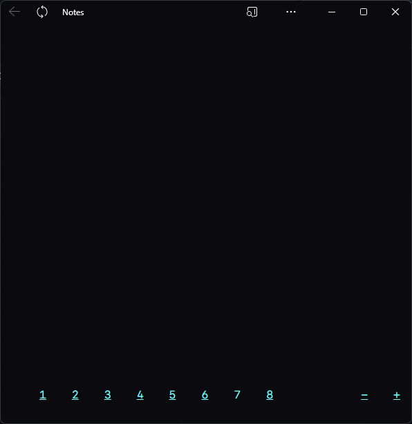

# Notes

This application serves to allow taking notes which are persisted automatically, and user can change between eight sheets to take different notes on each one (kudos to original Macintosh Note Pad for the inspiration).

Text size can be also adjusted and will be persisted as a user preference.

Application persists user notes in local storage, and its robustness is therefore limited by the local storage limitations in browsers. A fully-fledged database solution is planned in the future.

I drew the icon in MS Paint, just to have something to work with, please, be kind.

**Live demo:** https://candid-mousse-5b640f.netlify.app/
